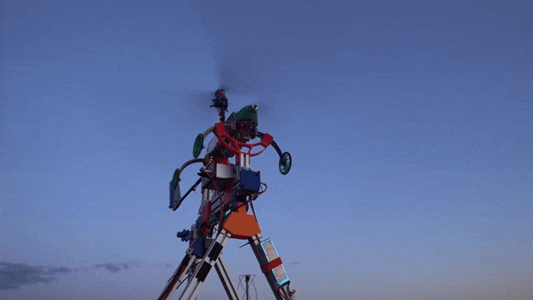
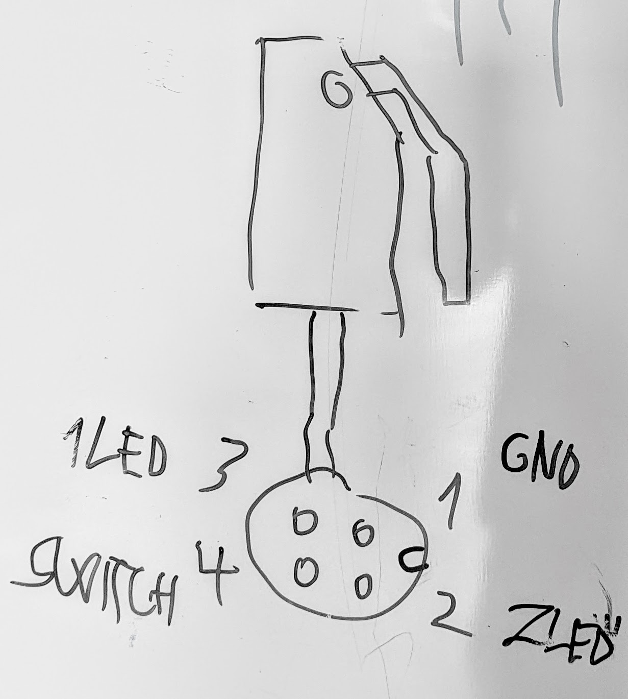

# TF-SIMPLEPLATFORM - UAV autogyro takeoff platform

Device for launching unmanned drones (especialy autogyro type) from moving platforms (e.g. automobile roof).

The TF-SIMPLEPLATFORM is designed for launching of the unmanned [autogyro TF-G2](https://github.com/ThunderFly-aerospace/TF-G2/). Thanks to the combination of the this starting platform and the automatic takeoff mode of the TF-G2 unmanned autogyro, it is possible to perform safe and almost unattended takeoff. Platform is controlled from GCS based on realtime data from the UAV trough data-link. The platform can be disconnected manually (by operator) due to service operations.

## Parameters

| Parameter | Value | Note |
|----------|---------|----------|
| Platform type | Rigid mount | Aluminium profiles design |
| Actuator| Clamps | |
| Manual override | Button on platform | |
| Remote control interface | USB/RS232 | |
| Operator takeoff confirmation | Yes, remote button | Wired controller |
| Control Software | Firmware, Mavlink interface in GCS | |
| Supported UAVs | [ThunderFly TF-G2](https://github.com/ThunderFly-aerospace/TF-G2) | |
| Supported flight stack | PX4 | (MavLink protcol) |

## Clamps mount mechanism

## Usage

  1. ARM the autogyro
  2. Push the trigger switch
  3. Run by car few tens of meters
  4. Autogyro will takeoff automatically from roof. 

### Installation
The first step is to assemble the platform onto the movable platform. The standard method of assembly involves inserting it into plastic parts and securing it with a screw. It is important to tight the screw with the correct torque to prevent spontaneous loosening of the screw. 

### Wiring 
After mounting the platform, it is necessary to correctly connect it. The outdoor part is connected with the inner box using a cable terminated on both ends with the same 12-pin connector. This cable provides both power and data communication for the platform. 

## Description of control elements
The platform is equipped with a variety of actuators, sensors, control elements and visualization components. 

### Actuators
 - Servo motor for rotor holder
 - Servo motor for clamp

### Sensors 
 - Sensor of drone presence (in future version)

### Control elements
 - Button on platform itself - Restart button
 - Botton on platform itself - Open clamp
 - Button on wired controller - Permission for takeoff
 - External input for breake signal

### Visualization elements
 - 2 LEDS on platform (Platform status) 
 - 1 Loud buzzer on platform (Release status)
 - 2 LEDS on wired controller (Platform status)
 - 1 Buzzen on wired controller (Release status)

<!-- 

 -->
